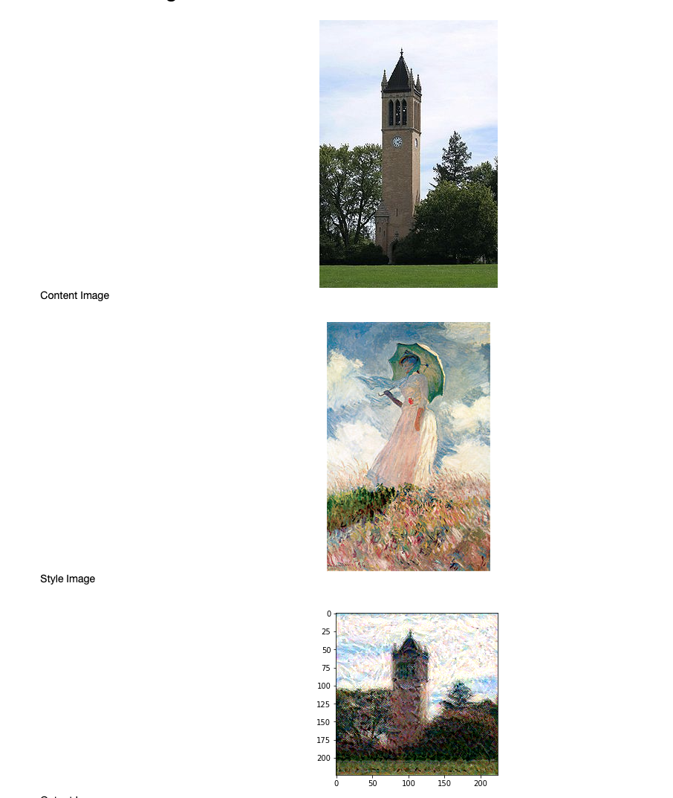
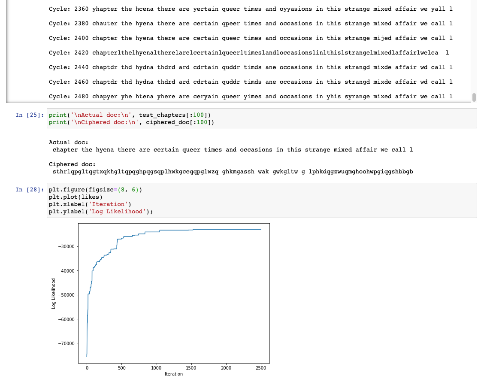
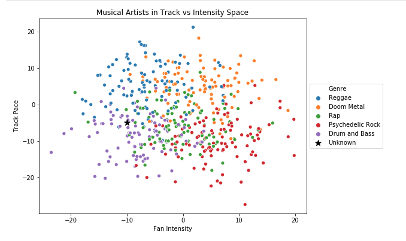
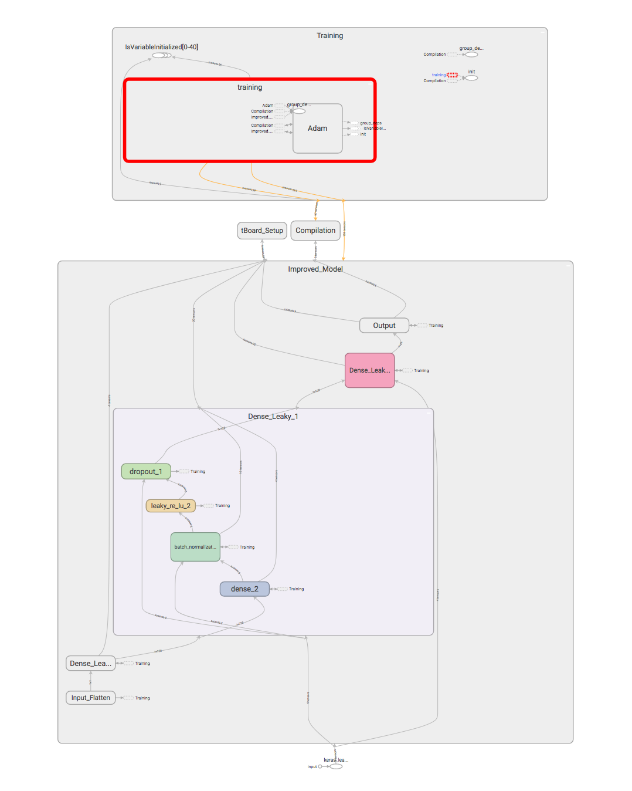

# Machine Learning Exploration

Projects to explore and develop ML intuition.

 ## Transfer Learning with Convolutional Neural Nets
 Use a VGG architecture with pre-trained weights to apply the style of one image to another with a simple transformation. This takes some tuning to get good results. 
 
 
 
 
 ## Decoding Ciphers with Markov Chain Monte Carlo (MCMC)
 Contains the entirety of Moby Dick, chapter by chapter. Using a substitution cipher, encode chapters the book into a scrambled language, then efficiently recover the original text using MCMC. 
 
 
 
 
 ## K-Nearest Neighbors from Scratch
 A walkthrough of one of the most simple classification algorithms, with intuition how how it works geometrically.
 

 
 
 ## Vanilla Neural Networks and MNIST with Tensorboard
 
Train simple neural networks in Keras with a Tensorflow backend. Interpret the model's evolution at train-time through a local TensorBoard instance.

